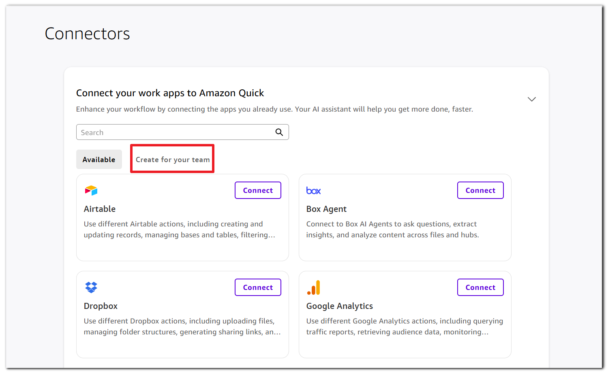
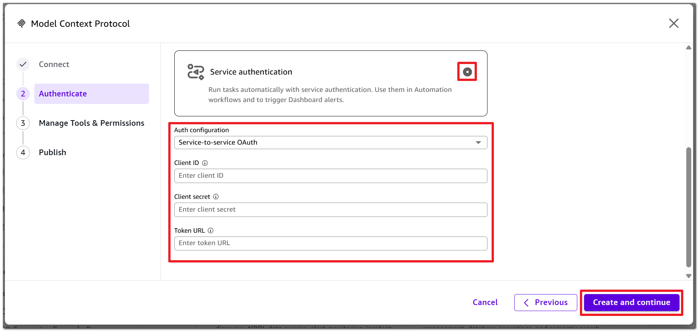
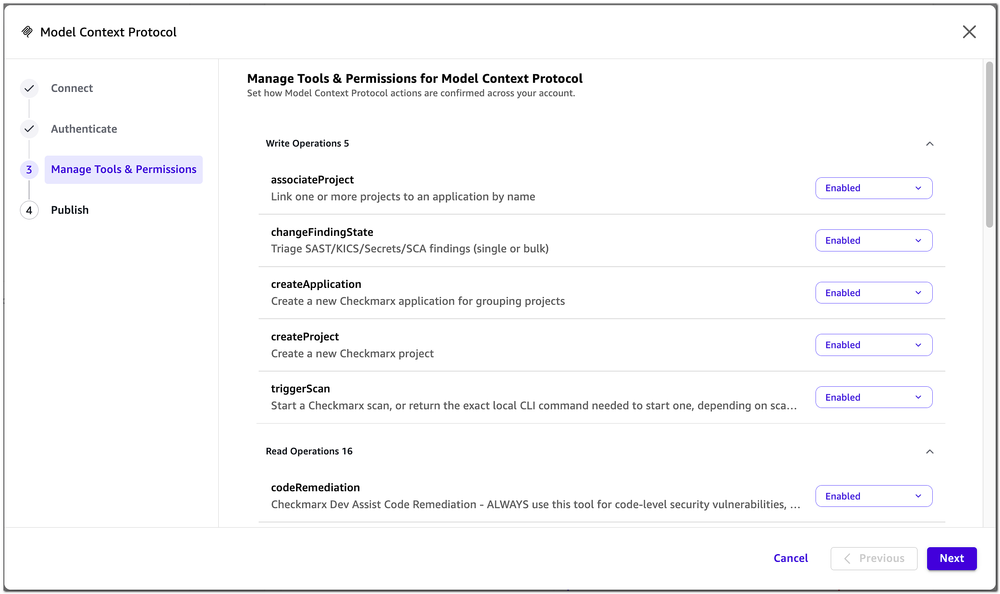

# Checkmarx MCP Server

## Overview

Modern development and security workflows are increasingly centered around AI-assisted environments. However, traditional security tooling often requires users to leave these environments to take action, disrupting productivity and reducing engagement. The Checkmarx MCP Server addresses this gap by bringing security operations directly into the tools where users already work — making it easier to adopt, integrate, and act on security insights in real time

The Checkmarx MCP Server acts as a translation layer between MCP-compatible clients and the Checkmarx One REST APIs, enabling developers and security teams to interact with Checkmarx One from AI assistants and supported third-party integrations. Through these clients, users can interact with Checkmarx One using natural language within an IDE, terminal, chat, or other supported interface. Users can trigger scans, retrieve findings, and query security posture within AI workflows without needing to switch to the platform UI. That means that a developer can now request a scan and immediately receive prioritized results and a security lead can query organization-wide coverage and risk trends, without disrupting their workflows.

Built on the Model Context Protocol (MCP), an open standard for connecting AI applications and platforms to external tools and data sources, the Checkmarx MCP Server exposes a curated set of capabilities that map to Checkmarx One functionality. It acts as a controlled interface between AI agents and the Checkmarx APIs, enabling secure, structured access to data and actions through natural language. This release introduces the initial phase of the MCP Server - providing a minimal set of capabilities required to support meaningful, end-to-end workflows for both developers and AppSec teams. We will soon be adding more advanced capabilities such as automated triage, external integrations, and agent-driven workflows.

## Who is it for?

* **Developers** - Trigger scans and receive prioritized findings directly within the IDE or terminal, without switching between tools.
* **AppSec Engineers** - Query findings by severity, type, or scanner; manage project and application inventory; and monitor scan status.
* **Security Leads** - Gain organization-wide visibility into scan coverage, risk posture, and trends across teams through simple, natural language queries.

## Supported Scanners and Tools

* **Scanners** - Supported for **SAST**, **SCA**, **IaC Security**, **Secrets** and **API Security**.
* **Tools** - Currently provides tools in the areas of remediation, scan workflow, project, and application management, scan history and triage. Other advanced Checkmarx One workflows are not yet supported.

Triage tools are not yet supported for the **API Security** scanner.

## Prerequisites

Certain MCP features require the Checkmarx CLI to be installed and configured. To enable these features, ensure that the Checkmarx CLI is installed and that the MCP can access its executable path.

For best results, use credentials with matching permissions in both the Checkmarx CLI and the MCP server configuration. Permission mismatches may prevent some operations from completing successfully.

Local directory scanning specifically requires access to the Checkmarx CLI and is not available through the MCP alone.

## Data Security

* Data in encryption in transit - TLS 1.2+ on all connections
* No credential storage or logging
* Complete tenant segregation
* RBAC passthrough enforced - no privilege escalation via MCP
* Repo URL credentials always sanitized - never shown to user
* No destructive activities (e.g., project deletion) allowed via MCP

## Authentication and Permissions

Authentication is done using an OAuth login workflow or by submitting an API Key. Once authenticated, the MCP is able to interact with the relevant tenant account based on the specific set of permissions assigned to the user or API Key.

The MCP is available to all Checkmarx One customers. However, functionality is limited based on:

* **License Packages** - Only tools licensed for your account are available. For example, remediation tools are only available for accounts with **Checkmarx One Assist**, **AI Protection** or **Checkmarx Developer Assist** license. In addition, only licensed scanners can be run.
* **User Permissions** - Tools are only available to users with the relevant permission for each action (based on Checkmarx One IAM). For example, only users with permission to run scans can initiate a scan via the MCP. And, only users with access to a particular project can ask the MCP to view results for that project.

### Supported Authentication Methods

Checkmarx MCP supports the following authentication methods:

* **API Key** -Submit a JWT (JSON Web Token) access token. Access tokens are obtained via the Checkmarx web application (UI), see [Creating an API Key for Checkmarx One Integrations](https://docs.checkmarx.com/en/34965-182096-creating-an-api-key-for-checkmarx-one-integrations.html).
* **Predefined OAuth Client** — Uses a fixed OAuth client that is registered in advance. This is the simpler option, relying on a known, shared client identity. Use this predefined clientId: `cx-mcp-client`
* **Dynamic OAuth Client Registration** (DCR) — The MCP client registers itself dynamically at runtime by calling the authorization server's registration endpoint, obtaining its own client credentials on the fly.

There is an upper limit of 500 clients per tenant using DCR authentication. When the limit is reached, the following message is displayed:

_Policy 'Max Clients Limit' rejected request to client-registration service_

In this case, you must use one of the other authentication methods for some of your users.

#### Supported Methods by Platform

The following table shows which authentication methods are supported for each platform.

| Platform                      | API Key | Predefined OAuth Client |    DCR   |
| ----------------------------- | :-----: | :---------------------: | :------: |
| Claude Code                   |    ✔    |            ✔            |     ✔    |
| Gemini CLI                    |    ✔    |            ✔            |     ✔    |
| Codex CLI                     |    ✔    |            x            |     ✔    |
| Copilot CLI                   |    ✔    |            x            |     ✔    |
| Cursor IDE                    |    ✔    |            ✔            | See note |
| VS Code                       |    ✔    |            ✔            |     ✔    |
| JetBrains IDEs                |    ✔    |            x            |     x    |
| Windsurf                      |    ✔    |            x            |     ✔    |
| Kiro IDE                      |    ✔    |            x            |     ✔    |
| Antigravity IDE               |    ✔    |            x            |     ✔    |
| Claude Web and Claude Desktop |    x    |            ✔            |     ✔    |
| Amazon Quick                  |    x    |            ✔            |     ✔    |

## Installation and Configuration

The Checkmarx MCP Server can be integrated with AI assistants and development tools that connect directly to the MCP server, as well as with supported third-party platforms.

* **AI Assistants and Development Tools** — Connect an MCP-compatible AI assistant or development tool directly to the Checkmarx MCP Server. Installation and authentication methods vary by platform.
* **Third-Party Integrations** — Connect a third-party platform, such as Amazon Quick, to the Checkmarx MCP Server. These integrations may require additional configuration within the third-party platform.

### Checkmarx One Server Base URLs


For all installation flows, you will need to provide your Checkmarx One Server Base URL.

* US Environment - https://ast.checkmarx.net
* US2 Environment - https://us.ast.checkmarx.net
* EU Environment - https://eu.ast.checkmarx.net
* EU2 Environment - https://eu-2.ast.checkmarx.net
* DEU Environment - https://deu.ast.checkmarx.net
* Australia & New Zealand – https://anz.ast.checkmarx.net
* India - https://ind.ast.checkmarx.net
* India 2 - https://ind-2.ast.checkmarx.net/
* Singapore - https://sng.ast.checkmarx.net
* UAE - https://mea.ast.checkmarx.net
* Israel - https://gov-il.ast.checkmarx.net


### IAM Base URLs


For some third-party integration configurations, you will need to provide your IAM Base URL.

* US: https://iam.checkmarx.net
* US2: https://us.iam.checkmarx.net
* EU: https://eu.iam.checkmarx.net
* EU2: https://eu-2.iam.checkmarx.net
* DEU: https://deu.iam.checkmarx.net
* Australia & NZ: https://anz.iam.checkmarx.net
* India: https://ind.iam.checkmarx.net
* Singapore: https://sng.iam.checkmarx.net
* UAE: https://mea.iam.checkmarx.net


## AI Assistants and Developer Tools

Use the following instructions to connect your AI assistant or development tool directly to the Checkmarx MCP Server. Select your platform below. The supported authentication methods for each platform are listed in the recommended order.



You can register, authenticate and enable the MCP directly from the command line. Follow the instructions below for your chosen authentication method.

#### API Key

Enter the following command, replacing the placeholders:

```
claude mcp add --transport http --scope user Checkmarx <CX_BASE_URL>/api/security-mcp/mcp --header "Authorization: <API_KEY>"
```

#### Predefined OAuth Client

*   Enter the following command, replacing the placeholders:

    ```
    claude mcp add  --transport http   Checkmarx ${CX_BASE_URL}/api/security-mcp/mcp/{tenant_name} --client-id cx-mcp-client
    ```
* Enter `/mcp` to view the Checkmarx MCP.
* Select **Authenticate**.
* You will be redirected to Checkmarx One login.

#### DCR

*   Enter the following command, replacing the placeholders:

    ```
    claude mcp add --transport http --scope user Checkmarx <CX_BASE_URL>/api/security-mcp/mcp/<TENANT_NAME>
    ```
* Enter `/mcp` to view the Checkmarx MCP.
* Select **Authenticate**.
* You will be redirected to Checkmarx One login.



You can register, authenticate and enable the MCP directly from the command line. This method uses an API Key.

#### API Key

Enter the following command, replacing the placeholders:

```
gemini mcp add --scope user --transport http Checkmarx <CX_BASE_URL>/api/security-mcp/mcp --header "Authorization: <API_KEY>"
```

#### Manual Installation

Follow the instructions below for your chosen authentication method.

#### Predefined OAuth Client

* Open `~/.gemini/settings.json`.
*   Add the following MCP server configuration:

    ```
    {
      "mcpServers": {
        "Checkmarx": {
          "httpUrl": "<CX_BASE_URL>/api/security-mcp/mcp/<TENANT_NAME>",
          "oauth": {
            "clientId": "cx-mcp-client"
          }
        }
      }
    }
    ```
* Replace the placeholder values and save the configuration.
* Authenticate using the command: `/mcp auth Checkmarx`.
* Complete the browser-based authentication flow.

#### DCR

* Open `~/.gemini/settings.json`.
*   Add the following MCP server configuration:

    ```
    {
      "mcpServers": {
        "Checkmarx": {
          "httpUrl": "<CX_BASE_URL>/api/security-mcp/mcp/<TENANT_NAME>"
        }
      }
    }
    ```
* Replace the placeholder values and save the configuration.
* Authenticate using the command: `/mcp auth Checkmarx`.
* Complete the browser-based authentication flow.



Follow the instructions below for your chosen authentication method.

#### DCR

* Open `~/.codex/config.toml`.
*   Add the following MCP server configuration:

    ```
    [mcp_servers.Checkmarx]
    url = "<CX_BASE_URL>/api/security-mcp/mcp/<TENANT_NAME>"
    ```
* Replace the placeholder values and save the configuration.
* Authenticate using the command: `codex mcp login Checkmarx`.
* Complete the browser-based authentication flow.

#### API Key

* Open `~/.codex/config.toml`.
*   Add the following MCP server configuration:

    ```
    [mcp_servers.Checkmarx]
    url = "<CX_BASE_URL>/api/security-mcp/mcp"

    [mcp_servers.Checkmarx.http_headers]
    Authorization = "<API_KEY>"
    ```
* Replace the placeholder values and save the configuration.



You can register, authenticate and enable the MCP directly from the command line. Follow the instructions below for your chosen authentication method.

#### API Key

Enter the following command, replacing the placeholders:

```
copilot mcp add --transport http Checkmarx <CX_BASE_URL>/api/security-mcp/mcp --header "Authorization: <API_KEY>"
```

#### DCR

*   Enter the following command, replacing the placeholders:

    ```
    copilot mcp add --transport http Checkmarx <CX_BASE_URL>/api/security-mcp/mcp/<TENANT_NAME>
    ```
* Enter `/mcp` to view the Checkmarx MCP.
* Select **Checkmarx**.
* Select **Authenticate**.
* You will be redirected to Checkmarx One login.



Follow the instructions below for your chosen authentication method.

#### Predefined OAuth Client

* Open `~/.cursor/mcp.json`.
*   Add the following MCP server configuration:

    ```
    {
      "mcpServers": {
        "Checkmarx": {
          "url": "<CX_BASE_URL>/api/security-mcp/mcp/<TENANT_NAME>",
          "auth": {
            "CLIENT_ID": "cx-mcp-client"
          }
        }
      }
    }
    ```
* Replace the placeholder values and save the configuration.
* Authenticate from **Settings > MCP**.
* Complete the browser-based authentication flow.

#### API Key

* Open `~/.cursor/mcp.json`.
*   Add the following MCP server configuration:

    ```
    {
      "mcpServers": {
        "Checkmarx": {
          "url": "<CX_BASE_URL>/api/security-mcp/mcp",
          "headers": {
            "cx-origin": "Cursor",
            "Authorization": "<API_KEY>"
          }
        }
      }
    }
    ```
* Replace the placeholder values and save the configuration.

#### DCR


There is a known issue that is causing DCR authentication to fail in Cursor. Please use a predefined client until the issue is resolved.


* Open `~/.cursor/mcp.json`.
*   Add the following MCP server configuration:

    ```
    {
      "mcpServers": {
        "Checkmarx": {
          "url": "<CX_BASE_URL>/api/security-mcp/mcp/<TENANT_NAME>"
        }
      }
    }
    ```
* Replace the placeholder values and save the configuration.
* Complete the browser-based authentication flow.



#### Predefined OAuth Client

* Open the user configuration with **MCP: Open User Configuration** from the Command Palette (Ctrl+Shift+P / Cmd+Shift+P).
*   Add the following MCP server configuration:

    ```
    {
      "servers": {
        "checkmarx": {
          "type": "http",
          "url": "<CX_BASE_URL>/api/security-mcp/mcp/<TENANT_NAME>",
          "oauth": {
            "clientId": "cx-mcp-client"
          }
        }
      }
    }
    ```
* Replace the placeholder values and save the configuration.
* Authenticate from **Settings > MCP**.
* Complete the browser-based authentication flow.

#### DCR

* Open the user configuration with **MCP: Open User Configuration** from the Command Palette (Ctrl+Shift+P / Cmd+Shift+P).
*   Add the following MCP server configuration:

    ```
    {
      "servers": {
        "checkmarx": {
          "type": "http",
          "url": "<CX_BASE_URL>/api/security-mcp/mcp/<TENANT_NAME>"
        }
      }
    }
    ```
* Replace the placeholder values and save the configuration.
* Complete the browser-based authentication flow.

#### API Key

* Open the user configuration with **MCP: Open User Configuration** from the Command Palette (Ctrl+Shift+P / Cmd+Shift+P).
*   Add the following MCP server configuration:

    ```
    {
      "servers": {
        "checkmarx": {
          "type": "http",
          "url": "<CX_BASE_URL>/api/security-mcp/mcp",
          "headers": {
            "cx-origin": "Vscode",
            "Authorization": "<API_KEY>"
          }
        }
      }
    }
    ```
* Replace the placeholder values and save the configuration.



Applies to IntelliJ IDEA, PyCharm, GoLand, WebStorm, Rider and other JetBrains IDEs with AI Assistant. JetBrains AI Assistant does not support OAuth-based MCP authentication — only a static token supplied as a request header. To install, follow the instructions below.

#### API Key

* Open **Settings > Tools > AI Assistant > Model Context Protocol (MCP)**.
* Click **Add**.
* In the **New MCP Server** dialog, select the **Streamable HTTP** connection type (not STDIO).
*   Switch the dialog to **As JSON** and enter the following configuration:

    ```
    {
      "mcpServers": {
        "Checkmarx": {
          "url": "<CX_BASE_URL>/api/security-mcp/mcp",
          "headers": {
            "cx-origin": "Jetbrains",
            "Authorization": "<API_KEY>"
          }
        }
      }
    }
    ```
* Replace the placeholder values and save the configuration.
* Set the server level to **Global** so the MCP is available in all projects, rather than **Project**, which limits it to the current project.
* Click **OK**, then **Apply** to start the server.



#### DCR

* Open `~/.codeium/windsurf/mcp_config.json`.
*   Add the following MCP server configuration:

    ```
    {
      "mcpServers": {
        "Checkmarx": {
          "serverUrl": "<CX_BASE_URL>/api/security-mcp/mcp/<TENANT_NAME>"
        }
      }
    }
    ```
* Replace the placeholder values and save the configuration.
* Select **Settings > Cascade > MCP Servers > Refresh**.
* Authenticate from the MCP panel.

#### API Key

* Open `~/.codeium/windsurf/mcp_config.json`.
*   Add the following MCP server configuration:

    ```
    {
      "mcpServers": {
        "Checkmarx": {
          "serverUrl": "<CX_BASE_URL>/api/security-mcp/mcp",
          "headers": {
            "cx-origin": "Windsurf",
            "Authorization": "<API_KEY>"
          }
        }
      }
    }
    ```
* Replace the placeholder values and save the configuration.
* Select **Settings > Cascade > MCP Servers > Refresh**.



#### DCR

* Open `~/.kiro/settings/mcp.json`.
*   Add the following MCP server configuration:

    ```
    {
      "mcpServers": {
        "Checkmarx": {
          "url": "<CX_BASE_URL>/api/security-mcp/mcp/<TENANT_NAME>"
        }
      }
    }
    ```
* Replace the placeholder values.
* Click **Authenticate**.
* Complete the browser-based authentication flow.

#### API Key

* Open `~/.kiro/settings/mcp.json`.
*   Add the following MCP server configuration:

    ```
    {
      "mcpServers": {
        "Checkmarx": {
          "url": "<CX_BASE_URL>/api/security-mcp/mcp",
          "headers": {
            "cx-origin": "Kiro",
            "Authorization": "<API_KEY>"
          }
        }
      }
    }
    ```
* Replace the placeholder values and save the configuration.



#### DCR

* Open `~/.gemini/config/mcp_config.json`.
*   Add the following MCP server configuration:

    ```
    {
      "mcpServers": {
        "Checkmarx": {
          "serverUrl": "<CX_BASE_URL>/api/security-mcp/mcp/<TENANT_NAME>"
        }
      }
    }
    ```
* Replace the placeholder values.
* The MCP is added in the **Install MCP** section of the IDE.
* Click **Authenticate**.

#### API Key

* Open `~/.gemini/config/mcp_config.json`.
*   Add the following MCP server configuration:

    ```
    {
      "mcpServers": {
        "Checkmarx": {
          "serverUrl": "<CX_BASE_URL>/api/security-mcp/mcp",
          "headers": {
            "Authorization": "<API_KEY>"
          }
        }
      }
    }
    ```
* Replace the placeholder values.



* Navigate to **Settings > Connectors**.
* Click the **Add** button.
* Hover over **Custom**, then select **Web**.
* Add your connector's remote MCP server URL: `<CX_BASE_URL>/api/security-mcp/mcp/<TENANT_NAME>`.
* To use a predefined client ID, click **Advanced settings** and specify the OAuth Client ID: `cx-mcp-client`. Leave it empty to use DCR.
* Click **Add**, then **Connect**, and complete the Checkmarx One login.


Enterprise administrators can introduce custom connectors as described [here](https://support.claude.com/en/articles/11175166-get-started-with-custom-connectors-using-remote-mcp?utm_source=chatgpt.com#h_3d1a65aded).




### Troubleshooting

| Message or symptom                                                           | Cause                                                                      | Resolution                                                                 |
| ---------------------------------------------------------------------------- | -------------------------------------------------------------------------- | -------------------------------------------------------------------------- |
| `401 Unauthorized` on all calls                                              | API Key invalid, expired, or issued in a different environment             | Regenerate the key and confirm the Base URL matches the issuing tenant     |
| `401` after a successful browser login                                       | Token issued for a different tenant                                        | Verify `<TENANT_NAME>` in the endpoint URL                                 |
| `Policy 'Max Clients Limit' rejected request to client-registration service` | Tenant reached the 500 DCR client limit                                    | Use the Predefined OAuth Client or an API Key for some users               |
| `403 Forbidden` on a single operation                                        | Permission gating                                                          | The user lacks the Checkmarx One permission for that action                |
| Server does not connect                                                      | Endpoint URL shape                                                         | API Key endpoints have no tenant path segment; OAuth endpoints require one |
| `404 Not Found`                                                              | Trailing slash on the Base URL, or a mistyped `/api/security-mcp/mcp` path | Correct the URL                                                            |
| Configuration saved but no server appears                                    | Wrong root key                                                             | VS Code and Visual Studio use `servers`; other platforms use `mcpServers`  |
| Root key correct but no server appears                                       | Wrong URL field                                                            | Windsurf and Antigravity use `serverUrl`; Gemini CLI uses `httpUrl`        |
| Copilot CLI connects but exposes no tools                                    | `tools` field missing from a manually edited configuration                 | Add `"tools": ["*"]`                                                       |
| Server available in one project only                                         | Configuration written at project scope                                     | Reapply at user scope                                                      |
| Remediation tools not listed                                                 | License gating                                                             | Requires Checkmarx One Assist, AI Protection or Checkmarx Developer Assist |
| Local directory scan does not run                                            | Checkmarx One CLI not installed or not on `PATH`                           | Verify with `cx version`                                                   |
| Scan starts but the CLI step fails                                           | CLI and MCP configured with different credentials                          | Use matching credentials                                                   |

## Third-Party Integrations

Third-party platforms can integrate with the Checkmarx MCP Server to make Checkmarx tools available through their own AI agents and interfaces.

### Amazon Quick

Amazon Quick can be integrated directly with the Checkmarx MCP Server, enabling users to access Checkmarx capabilities through the Quick AI agent. Checkmarx MCP tools can also be used in Amazon Quick Flows, enabling you to turn interactions with Checkmarx into reusable workflows that can be run on demand or automatically on a schedule.

To view AWS documentation on this feature, see [Model Context Protocol (MCP) integration](https://docs.aws.amazon.com/quick/latest/userguide/mcp-integration.html).

#### Prerequisites

Before configuring the integration, make sure that you have access to:

* An **Amazon Quick Enterprise** subscription. MCP integration is not available on lower subscription tiers.
* Amazon Quick **Admin** permissions, required to create a connector under **Create for your team**.
* The Checkmarx One tenant and environment that you want to connect to.
* For **Service Authentication** method: An OAuth **Client ID** and **Client Secret** for that account. To create an OAuth client, see [Creating an OAuth Client for Checkmarx One Integrations](https://docs.checkmarx.com/en/34965-182097-creating-an-oauth-client-for-checkmarx-one-integrations.html). Ensure that the OAuth client you create is configured with the appropriate roles required to run the Checkmarx One functionality represented by the Checkmarx MCP tools.

#### Configure the Amazon Quick Integration

1. Log in to **Amazon Quick**.
2. In the left-hand navigation bar, hover over **More** and select **Connectors**.


3. On the Connector page, select **Create for your team**.



4. Select the **Model Context Protocol** tile.


5. In the **Connect** step:

* For **Name** enter a descriptive name for the integration.
* For **Description**, enter the purpose of the integration..
* For the MCP server endpoint, enter `<CX_BASE_URL>/api/security-mcp/mcp/<TENANT_NAME>`. Replace **\<CX\_BASE\_URL>** and **\<TENANT\_NAME>** with the actual values from your Checkmarx One environment.
* For **Connection type**, select **Public network**. Checkmarx One MCP is reachable over the public internet, so no Amazon Quick VPC connection is required.

6. Click **Next**.
7. In the **Authenticate** step, configure one of the following authentication methods:

#### User Authentication Flow

1. Select **User Authentication**.
2. If **Dynamic Client Registration (DCR)** is supported by the authorization server, Amazon Quick automatically registers an OAuth client based on the authorization metadata discovered from the MCP server. No additional OAuth configuration is required. **Skip to step 5**.

Connectors created through DCR consume one of the tenant's 500 dynamically registered OAuth clients. See [Supported Authentication Methods](checkmarx-mcp-server-V6-VERIFIED.md#supported-authentication-methods) for details.

3. If you are configuring the OAuth client manually, do one of the following:
   * To use the predefined Checkmarx OAuth client, enter `cx-mcp-client` in the **Client ID** field and select **Public OAuth client**.
   * To use a custom OAuth client, enter its **Client ID** and **Client Secret**. To learn how to create an OAuth client, see [Creating an OAuth Client for Checkmarx One Integrations](https://docs.checkmarx.com/en/34965-182097-creating-an-oauth-client-for-checkmarx-one-integrations.html).
4.  Enter the following endpoints:

    * For **Token URL**, enter: `https://<IAM-BASE-URL>/auth/realms/<TENANT_NAME>/protocol/openid-connect/token`.
    * For **Authorization URL**, enter: `https://<IAM-BASE-URL>/auth/realms/<TENANT_NAME>/protocol/openid-connect/auth`.

    Replace \<IAM-BASE-URL> and \<TENANT\_NAME> with the values for your Checkmarx One environment. For the complete list of IAM Base URLs, see [IAM Base URLs](checkmarx-mcp-server-V6-VERIFIED.md#iam-base-urls).

    * For **Redirect URL** – enter `https://{region}.quicksight.aws.amazon.com/sn/oauthcallback` Replace `{region}` with your AWS Region (for example, `us-east-1`).
5. Click **Create and Continue**.
6. In the Checkmarx One sign-in page that opens, sign in to authorize Amazon Quick.

#### Service Authentication Flow

1.  Select **Service authentication**.

    
2. Enter the **Client ID** and **Client secret** from your OAuth client.
3.  For **Token URL**, enter `https://<IAM-BASE-URL>/auth/realms/<TenantName>/protocol/openid-connect/token`.

    Replace \<IAM-BASE-URL> and \<TenantName> with the values for your Checkmarx One environment. For the complete list of IAM Base URLs, see [IAM Base URLs](checkmarx-mcp-server-V6-VERIFIED.md#iam-base-urls).
4. Click **Create and Continue.**
5. In the **Manage Tools & Permissions** step, verify that Quick has discovered the available Checkmarx MCP tools.



9. Click **Next** and then click **Publish**.
10. Share the integration with the users who need it. From the connector details page, choose the menu icon (⋮) and select **Share**. Until the connector is shared, it is available only to the user who created it.
11. If the integration uses **User Authentication**, each user must sign in to Checkmarx One before using the Checkmarx MCP tools. On the connector details page, choose **Sign in** and complete the Checkmarx One login. If the session later expires, choose **Re-Connect**.

If the integration uses **Service Authentication**, no individual Checkmarx One sign-in is required. Users access Checkmarx One through the service credentials configured for the integration.

* After publishing the integration, open the Quick AI agent and submit a prompt that uses a Checkmarx MCP tool. Verify that the agent can successfully retrieve information from your Checkmarx One environment. For example, ask the agent to list your Checkmarx projects.

Amazon Quick enforces a 60-second timeout on each MCP operation. The `resolveProject`, `triggerScan`, and `getTenantVulnerabilitiesSummary` tools are particularly likely to exceed this limit.

For `resolveProject` and `getTenantVulnerabilitiesSummary` execution time can depend on the amount of data retrieved. When using these tools, limit the scope of the request where possible. For example, search for a specific project or use a sufficiently specific search term rather than a broad term that may return a large number of projects.

For scans, use `triggerScan` to start the scan and then poll with getScanDetails rather than waiting for completion in a single call

#### Sample Workflow: Weekly Organization-Wide Vulnerability Report

Once the Amazon Quick integration is published, Checkmarx MCP tools are available as _actions_ in **Amazon Quick Flows** - Quick's workflow builder. You can use these actions to create a recurring workflow that retrieves vulnerability data across your Checkmarx One tenant and generates a weekly report.

* **Prove the tools work in chat**. Open the Quick AI agent and enter a prompt such as "Summarize the current vulnerabilities across my Checkmarx tenant, broken down by severity." The agent runs the following tools:
  1. `getTenantVulnerabilitiesSummary` — Returns aggregate vulnerability counts for the tenant, grouped by severity.
  2. `listApplications` — Lists the applications in the account, so the summary can be attributed to business units.
  3. `getApplicationDetails` — Retrieves the risk posture for a specific application, for the applications you want broken out individually.
*   **Convert the conversation into a flow**. With the conversation open, choose the Quick Flows icon in the chat bar, then choose **Create Flow from conversation**. Quick generates a natural-language prompt, name, and description from what you just did. Review them and choose **Generate Flow**.

    Alternatively, build the flow directly: choose **Flows** in the navigation pane, choose **Create Flow**, and describe the report you want — for example, "Every Monday, summarize all Checkmarx vulnerabilities across my organization by severity and by application, list the ten highest-severity new findings, and email me the result."
* **Review the generated steps**. Confirm the flow uses the Checkmarx action steps you expect and add a reasoning group step if you want the model to rank, filter, or narrate the results rather than return raw counts. Switch to **Run mode** and run it once manually to verify the output before scheduling.
*   **Put it on a weekly schedule**. With the flow open in **Run mode**, choose the scheduling icon, then **Create schedule**. Name the schedule, set the recurrence to **weekly**, and choose a start date and time zone. Provide any default inputs the flow expects, then configure action permissions and choose **Save**.

    Quick emails you when each run completes, with a link to the results. Run history is retained for 30 days and can be filtered to scheduled runs or failed runs.

**Considerations for Scheduled Flows**

* **Use Service Authentication for scheduled flows**. Scheduled flows should use Service Authentication so that they do not depend on an individual user's interactive Checkmarx One session. The flow runs with the permissions assigned to the OAuth client, so configure the client with only the permissions required by the workflow.
* **Use unattended execution only for read-only workflows**. Amazon Quick can run scheduled flows without requiring confirmation. Use this option only for workflows that retrieve information. For operations that change data or initiate actions in Checkmarx One, such as triggering scans or remediation, require user confirmation.

#### Troubleshooting Amazon Quick

| Message or symptom                                             | **Cause**                                                                                     | **Resolution**                                                                                                                                                                                                                                                      |
| -------------------------------------------------------------- | --------------------------------------------------------------------------------------------- | ------------------------------------------------------------------------------------------------------------------------------------------------------------------------------------------------------------------------------------------------------------------- |
| Connector creation fails during authorization                  | The Amazon Quick callback URI is not registered for the OAuth client.                         | Contact Checkmarx Support to configure the required Amazon Quick redirect URI.                                                                                                                                                                                      |
| Discovery succeeds but publishing fails with `Creation failed` | A tool's `inputSchema` is not JSON Schema Draft 7 compliant.                                  | Contact Checkmarx Support. This indicates an issue with the server-side tool definition.                                                                                                                                                                            |
| Tool call fails with HTTP 424                                  | The operation exceeded Amazon Quick's 60-second timeout.                                      | For `resolveProject` and `getTenantVulnerabilitiesSummary`, limit the scope of the request to reduce the amount of data retrieved. For scans, use `triggerScan` to start the scan and poll with getScanDetails rather than waiting for completion in a single call. |
| Newly released Checkmarx MCP tools do not appear               | Amazon Quick registers the tool list when the integration is created and does not refresh it. | Delete the integration and create it again.                                                                                                                                                                                                                         |

## Using the MCP

Interact with Checkmarx One via natural language chat in your AI assistant. The MCP interprets your instructions and runs the appropriate tools to provide the requested information and initiate the appropriate activities. A single prompt can trigger a series of tools, with the AI Agent requesting confirmation or additional input before moving from one step to the next.

The following is a list of tools by category. More detailed information about each tool is available below.

* Remediation
  * packageRemediation
  * codeRemediation
  * imageRemediation
* Scan Workflow
  * planScan
  * triggerScan
  * getScanDetails
  * getLatestScans
  * listFindings
  * getFindingDetails
  * getTenantVulnerabilitiesSummary
* Finding Triage
  * changeFindingState
  * changeFindingSeverity
  * getTriageHistory
* Project Management
  * resolveProject
  * createProject
  * listProjects
  * getProjectConfig
* Application Management
  * listApplications
  * getApplicationDetails
  * createApplication
  * associateProject
* Scan History
  * listScans

### Sample Workflows

#### Scan Project

The MCP can be used to run an E2E flow of triggering a scan, viewing results, identifying risks, and remediating those risks. The process begins by the developer entering a chat "scan this project" (or similar prompt). AI Agent runs the following tools, asking for input and/or confirmation before moving from one step to the next:

1. `resolveProject` - Checks if a corresponding project already exists in your Checkmarx One account, based on project name.

To identify a project based on repository URL, other prompts are used. For example, trigger the `listProjects` tool by asking the agent to "Show Checkmarx projects", and search for the desired repository URL.

2. `createProject` - If the project doesn't exist, then a new project is created.
3. `getLatestScans` - For pre-existing projects, checks if a scan has already run on the same commit, enabling display of results from that scan.
4. `planScan` - Checks file types and determines which scanners to run.
5. `triggerScan` - The scan is run using the relevant scanners.
6. `getScanDetails` - Polls the status of the scan, until it is completed.

For longer scans, the scan will continue running in the background and the user needs to prompt to check for completion.

```
This tool also provides vulnerability summaries by severity upon scan completion.
```

7\. The developer can drill down further by asking additional questions like, "show me the critical vulnerabilities", "which packages have critical risks", "Show me all revealed secrets" etc. (triggering additional tools such as `listFindings` and `getFindingDetails`.

8. **Triage the finding** - After reviewing a finding, the developer can change its state or severity by asking, for example, "mark this finding as confirmed", "mark this finding as not exploitable", or "set this finding severity to high" (triggering `changeFindingState` or `changeFindingSeverity`). The agent asks for confirmation before applying the change.
9. After identifying a vulnerability that requires remediaton the user can give instructions to remediate by saying "fix it", "find a safer package", "remediate this finding" etc. (triggering `packageRemediation`, `codeRemediation` or `imageRemediation`).
